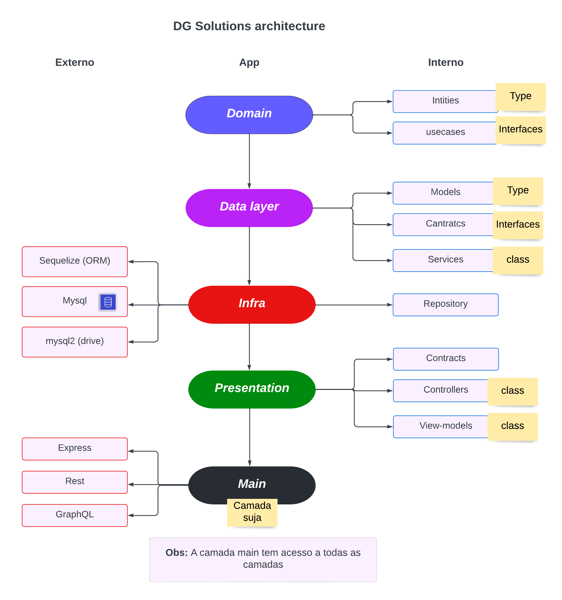

# Test Coodesh

## Information

- Coodesh: <a href="https://lab.coodesh.com/leodeymisonbasquete/nodejs-20201030">Referência do test da Coodesh</a>
- Description:

## Infra

example:


<p>
    My main goal of using clean architecture is to make the application not dependent on anything external, thus making it easier to maintain, test and change a technology.
</p>

### Request and response flow

```ts
export default (router: Router): void => {
  router.post(
    "/products",
    async (req: Request, res: Response): Promise<void> => {
      const page = parseInt(req.params.page) ? parseInt(req.params.page) : 1;
      const repo = new ProductsRepository();
      const loader = new ProductService(repo);
      const constroller = new ProductGetAllController(loader);
      const response = await constroller.handle(page);
      res.status(response.statusCode).json(response.data);
    }
  );
};
```

## Dependeces

## Stacks

- NodeJs
- Express
- TypeScript
- JavaScript (Configuration of jest)
- Clean architecture
- MongoDB (mongoose)
- Jest (Tests)
- Axios (Request)

## Instalation

## Routes

- [GET] /favicon.ico
  - Icone da empresa
    <br /><br />
- [GET] "/"
  <br /><br />
- [GET] "/products/:page?"
  <br /><br />
- [PUT] "/"
  <br /><br />
- [DELETE] "/"
